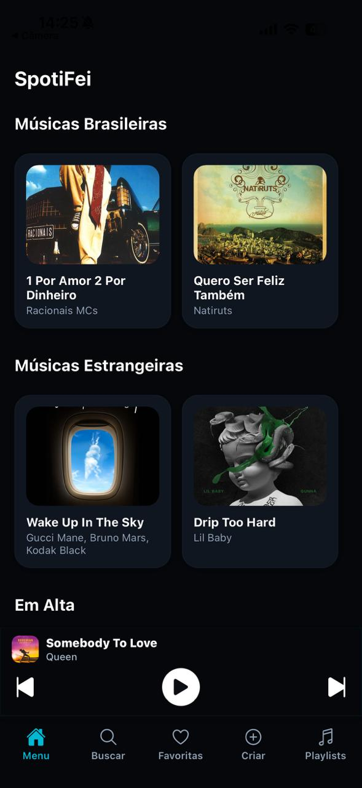
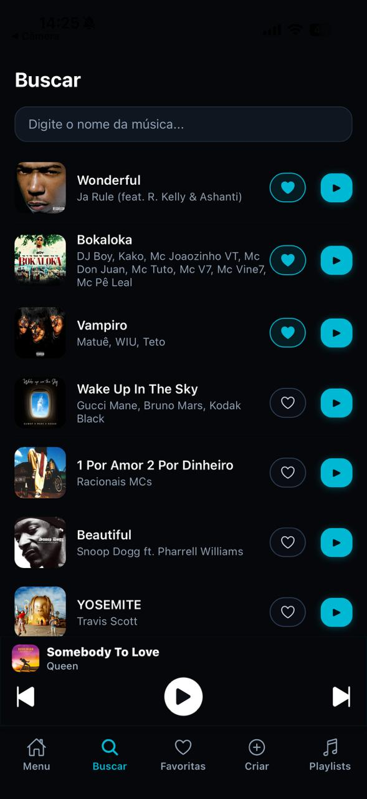
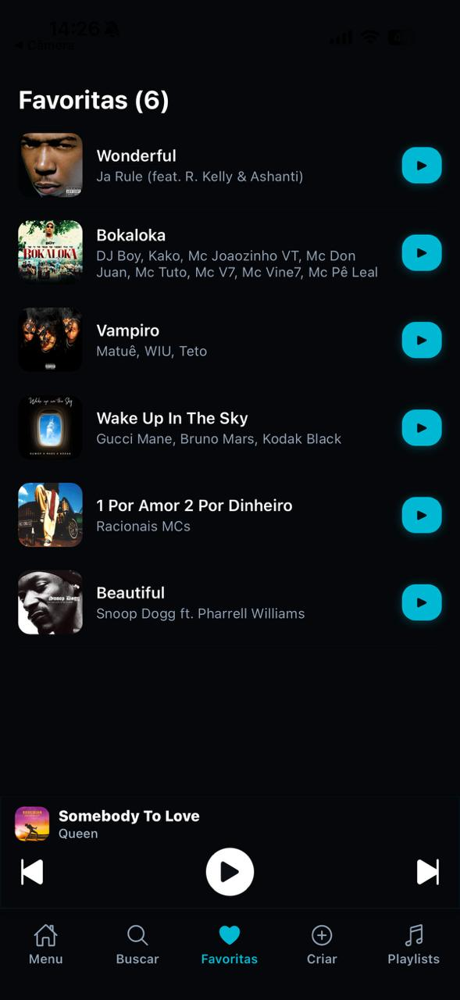
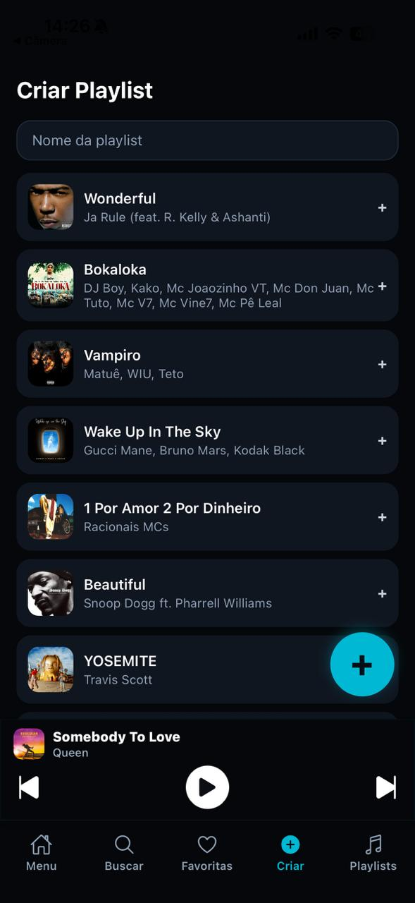
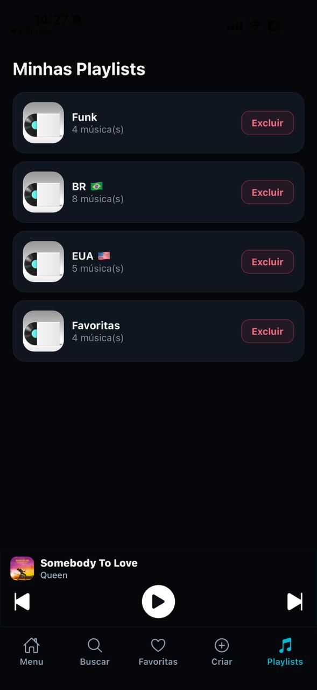
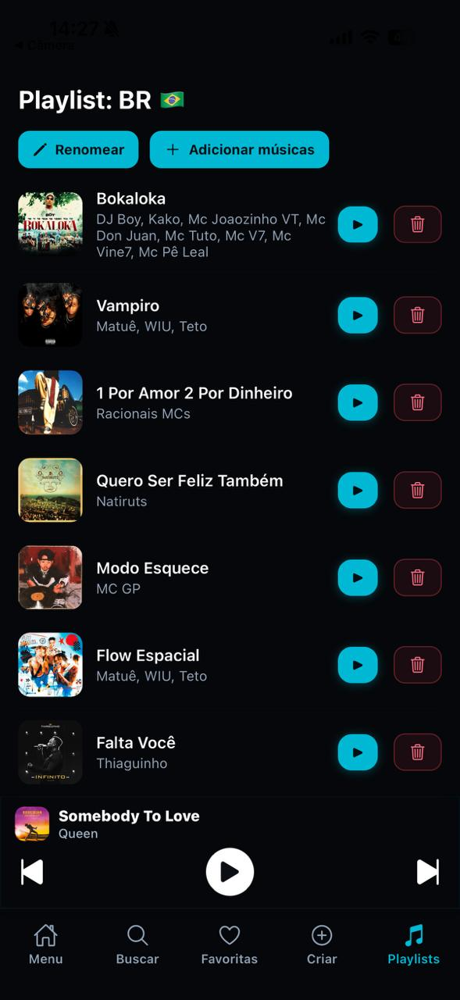
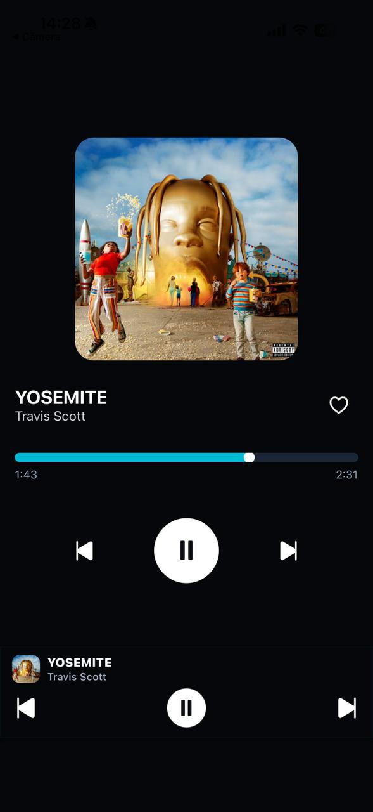

# 🎵 SpotiFei - Player de Música

O objetivo do projeto é criar um player funcional de música.

## 🎯 Visão Geral

O SpotiFei é um app de música simples e intuitivo, que permite:
- Reproduzir músicas locais
- Curtir faixas e acessar suas favoritas
- Criar playlists personalizadas
- Adicionar e remover músicas de playlists
- Ver o player completo com barra de progresso
- Trocar automaticamente para a próxima música ao terminar

> A motivação do app é demonstrar controle de estado, navegação, armazenamento local e reprodução de áudio **sem utilizar bibliotecas externas além das ensinadas.**

---

## 🛠 Tecnologias Utilizadas

| Tecnologia / Conceito | Uso no App |
|---|---|
| **React Native** | Interface e componentes |
| **Expo** | Execução do app e carregamento de áudio |
| **React Navigation** | Navegação entre telas e abas |
| **Hooks (useState, useEffect, useContext, useRef)** | Controle de estado e ciclo de vida |
| **AsyncStorage** | Armazenamento de playlists e músicas curtidas |
| **expo-av (Audio.Sound)** | Reprodução de áudio |

---

## 📌 Funcionalidades Detalhadas

| Funcionalidade | Descrição |
|---|---|
| **Buscar Música** | Filtro por nome ou artista |
| **Curtir Música** | Salvamento local em Favoritos |
| **Player Global** | Barra inferior exibida em todo o app |
| **Player Completo** | Controles, capa, barra de tempo e avanço |
| **Criar Playlists** | Seleciona músicas ao criar |
| **Gerenciar Playlists** | Renomear, adicionar e remover músicas |
| **Reprodução Contínua** | Ao terminar a faixa, toca a próxima automaticamente |

---

## 📸 Telas do App

<div align="center">

<table>
  <tr>
    <td></td>
    <td></td>
    <td></td>
  </tr>
  <tr>
    <td></td>
    <td></td>
    <td></td>
  </tr>
  <tr>
    <td></td>
    <td></td>
    <td></td>
  </tr>
</table>

</div>

---

## ▶️ Demonstração (Vídeo)

[🎥 Vídeo de demonstração](https://youtu.be/Ja0m4sInzNw?si=FWidM-BdKnfMVacq)

## 🔧 Instalação e Execução do Projeto

### ✅ Pré-requisitos
Antes de executar o projeto, certifique-se de ter instalado:
- **Node.js** (versão 18 ou superior)
- **Expo Go** no celular (Android / iOS)
- **Expo CLI** instalada globalmente (se ainda não tiver, rode):
```bash
npm install -g expo-cli

# 1. Clonar o repositório
git clone https://github.com/brandao1805/ProjetoJS.git

# 2. Entrar na pasta do projeto
cd ProjetoJS

# 3. Instalar as dependências necessárias
npm install

# 4. Iniciar o aplicativo
npx expo start
```

### 📱 Executando no Celular
1. Abra o aplicativo **Expo Go**
2. No terminal/navegador, escaneie o **QR Code**
3. O app iniciará automaticamente no seu dispositivo

---

## 🎓 Aprendizados

Durante o desenvolvimento do projeto, foi possível colocar em prática diversos conteúdos aprendidos em aula, como:

- Utilização de **componentes funcionais**
- Controle de estado com **useState**
- Efeitos de ciclo de vida com **useEffect**
- Comunicação global entre telas utilizando **Context API**
- Navegação com **React Navigation** (Tabs + Stack)
- Salvamento de dados usando **AsyncStorage**
- Reprodução de áudio com **expo-av**
- Organização de código e boas práticas de UI

O projeto ajudou a reforçar a importância de **organização de estado**, **separação de responsabilidades** e **persistência de dados** em aplicações móveis.

---

## 🚀 Próximos Passos (Possíveis Melhorias)

Algumas melhorias planejadas (ou que podem ser adicionadas futuramente):

- Adicionar botão **Aleatório / Repetir**
- Menu interativo podendo clicar na música
- Implementar sistema de login para permitir perfis
- **Confirmação antes de excluir uma playlist** (Alert)
- Playlist compartilhada entre usuários

---

## 👨‍💻 Autor

Desenvolvido por **Lucas de Almeida Brandão**  
Disciplina: **CCP150 – DESENVOLVIMENTO DE APLICATIVOS MÓVEIS**  
Centro Universitário FEI — 4º semestre


